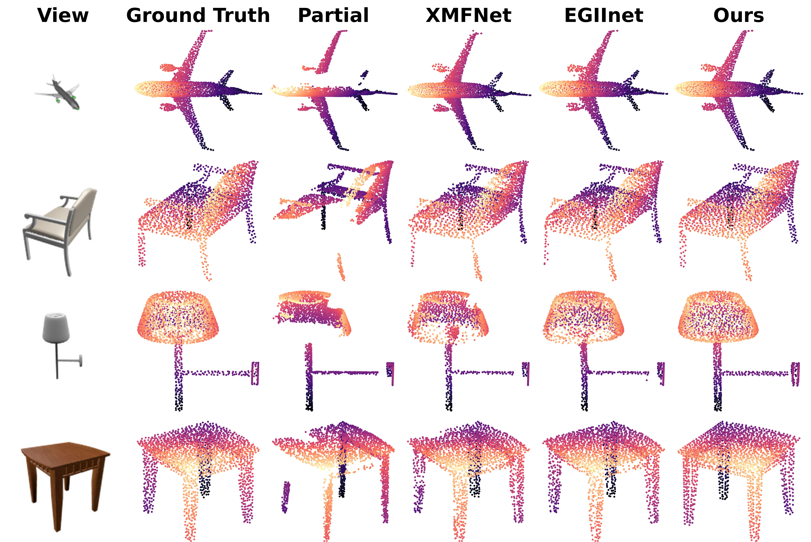

# I2PRef: Image-Driven Point Completion with Iterative Refinement

<!-- [](https://arxiv.org/abs/XXXX.XXXXX) -->

A deep learning framework for image-guided point cloud completion and refinement. Given a partial point cloud and a corresponding RGB image, the model produces a dense, complete point cloud using an adaptive transformer architecture conditioned on image features.

<div align="center">

</div>

## Requirements

Recommended environment (tested):
- Python 3.9
- PyTorch 2.7.1 with CUDA 12.8
- Cudatoolkit 12.9.1

**1. Create and activate a conda environment:**

```bash
conda create -n i2pref python=3.9 -y
conda activate i2pref
```

**2. Install PyTorch with CUDA 12.8 and Cudatoolkit 12.9.1:**

```bash
pip install torch==2.7.1+cu128 torchvision==0.22.1+cu128 --index-url https://download.pytorch.org/whl/cu128
conda install nvidia::cuda==12.9.1
```

**3. Install pytorch3d:**

```bash
FORCE_CUDA=1 pip install git+https://github.com/facebookresearch/pytorch3d.git@stable --no-build-isolation
```

**4. Install remaining dependencies:**

```bash
pip install -r requirements.txt
```

## Compiling CUDA Extensions

The following custom CUDA extensions must be compiled before running the code:

```bash
bash compile.sh
```

This compiles:
- `Chamfer3D` — Chamfer distance and Hausdorff distance kernels
- `pointnet2_ops_lib` — PointNet++ set abstraction operators
- `pointops` — Point cloud neighborhood operations

To uninstall and clean build artifacts:

```bash
bash remove.sh
```

## Dataset

This project uses the **ShapeNet-ViPC** dataset — paired partial point clouds and RGB images organised by ShapeNet category.

- Download: [ShapeNet-ViPC](https://pan.baidu.com/s/1NJKPiOsfRsDfYDU_5MH28A) (143GB, code: ar8l)
- After downloading, set `data_dir` in `pointnet2/exp_configs/ViPC.json`:

```json
"vipc_dataset_config": {
    "data_dir": "/your/path/to/ShapeNetViPC-Dataset",
    ...
}
```

## Training

Run from the `pointnet2/` directory:

```bash
python run.py \
    --batch_size 32 \
    --eval_batch_size 32 \
    --n_epochs 200 \
    --experiment_name i2pref \
    --run_name vipc_run1
```

Key arguments:

| Argument | Default | Description |
|---|---|---|
| `--batch_size` | `30` | Training batch size |
| `--eval_batch_size` | `30` | Validation batch size |
| `--n_epochs` | `200` | Total training epochs |
| `--experiment_name` | `i2pref` | WandB project name and output folder prefix |
| `--run_name` | auto-generated | Name for this specific run |
| `--root_directory` | `exp_vipc_output` | Root directory for checkpoints and logs |
| `--ckpt_path` | `""` | Path to a checkpoint to resume from |
| `--category` | `all` | ShapeNet category to train on (e.g. `plane`, `all`) |

Checkpoints are saved to `<root_directory>/<experiment_name>/<run_name>/checkpoints/`. Training is logged to [Weights & Biases](https://wandb.ai).

## Evaluation

Pretrained checkpoints are available for reproducing the results. [Download](https://drive.google.com/file/d/17216ELEOjEb_HWnkJv6gO0ewne3iwSja/view?usp=sharing) and place them in the `checkpoints/` directory.

Run from the `pointnet2/` directory:

```bash
python run.py \
    --test \
    --ckpt_path /path/to/checkpoint.ckpt \
    --category "cateogry" \ # e.g. "plane", "chair", "car", etc.
    --eval_batch_size 32
```

| Argument | Description |
|---|---|
| `--test` | Switch to evaluation mode |
| `--ckpt_path` | Path to the checkpoint file (required) |
| `--category` | ShapeNet category to evaluate |
| `--eval_batch_size` | Batch size for evaluation |

## Configuration

Model and training hyperparameters are set in `pointnet2/exp_configs/ViPC.json`. Command-line arguments override config values at runtime.

```json
{
    "train_config": { ... },
    "vipc_dataset_config": { ... },
    "trainer_args": { ... }
}
```


## Acknowledgements

This codebase builds upon the following work:

- **ViPC** — View-guided Point Cloud Completion dataset and baseline: [https://github.com/Hydrogenion/ViPC]

